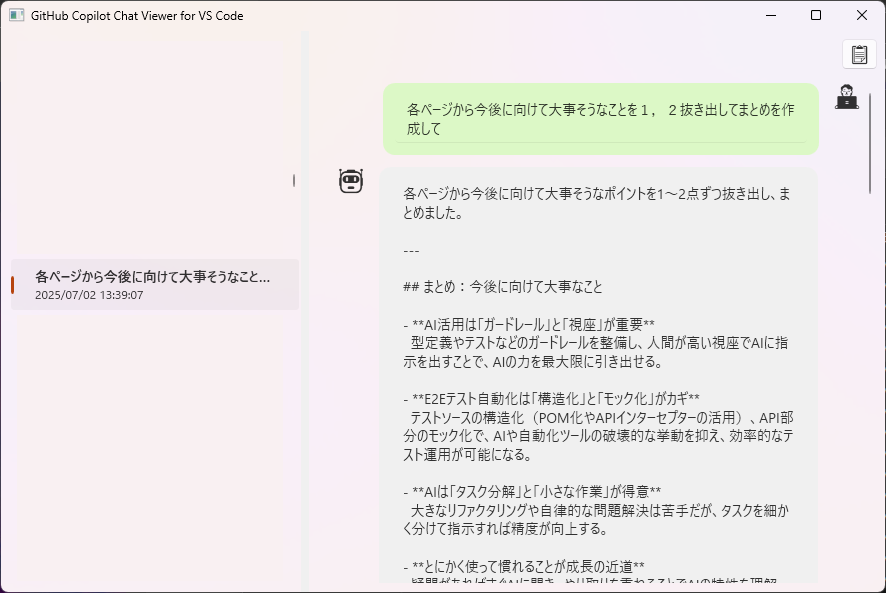
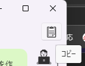
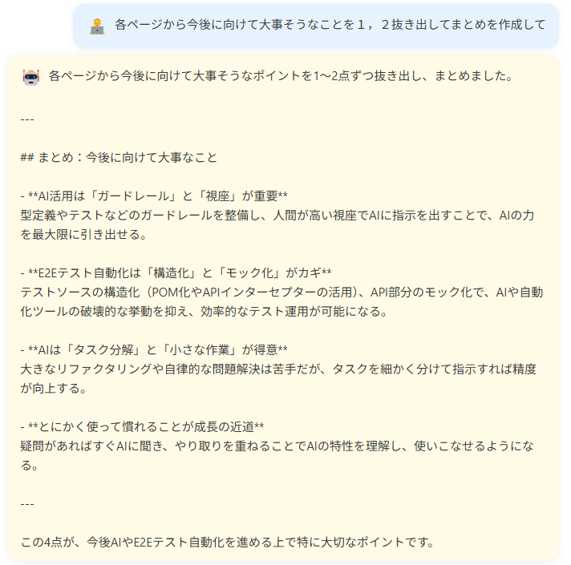

# CopilotChatViewer

GitHub Copilotとのチャット履歴を「チャットアプリ風UI」で一覧表示・検索できます。

## ダウンロード

最新版は [Releases](https://github.com/KatsuYuzu/CopilotChatViewer/releases) からダウンロードできます。

- Windows x64向けの単一実行ファイル（.NET 9ランタイム同梱）
- インストール不要、ZIPを解凍して実行するだけ

## 利用シーン

- AIとやりとりした内容を、あとから見返したい
- AIとやりとりした内容を、他の人に共有したい

## 機能

- **一覧表示**  
  Copilotのチャット履歴ファイル（JSON）を自動で検出し、左ペインに一覧表示します。
- **チャット内容の詳細表示**  
  選択した履歴の会話内容を、右ペインにユーザー・AIのアイコン付き吹き出しで表示します。
- **HTMLコピー**  
  クリップボードにHTML形式でコピーできます。





### HTMLコピーの内容

```html
<div><style>
.chat-container { display: flex; flex-direction: column; gap: 8px; }
.msg-row { display: flex; }
.msg-bubble { padding: 12px 16px; border-radius: 16px; font-family: 'Segoe UI', sans-serif; font-size: 15px; box-shadow: 0 2px 8px #0001; word-break: break-word; }
.user { border-radius: 16px; background: #e6f3ff; margin-left: auto; }
.copilot { border-radius: 16px; background: #fffbe6; margin-right: auto; }
.icon { font-size: 20px; vertical-align: middle; margin-right: 8px; }
.msg-row.user { justify-content: flex-end; }
.msg-row.copilot { justify-content: flex-start; }
</style>
<div class="chat-container">
<div class="msg-row user"><div class="msg-bubble user">
    <span class="icon">&#129489;‍&#128187;</span>各ページから今後に向けて大事そうなことを１，２抜き出してまとめを作成して
</div></div>
<div class="msg-row copilot"><div class="msg-bubble copilot">
    <span class="icon">&#129302;</span>各ページから今後に向けて大事そうなポイントを1～2点ずつ抜き出し、まとめました。<br/><br/>---<br/><br/>## まとめ：今後に向けて大事なこと<br/><br/>- **AI活用は「ガードレール」と「視座」が重要**  <br/>  型定義やテストなどのガードレールを整備し、人間が高い視座でAIに指示を出すことで、AIの力を最大限に引き出せる。<br/><br/>- **E2Eテスト自動化は「構造化」と「モック化」がカギ**  <br/>  テストソースの構造化（POM化やAPIインターセプターの活用）、API部分のモック化で、AIや自動化ツールの破壊的な挙動を抑え、効率的なテスト運用が可能になる。<br/><br/>- **AIは「タスク分解」と「小さな作業」が得意**  <br/>  大きなリファクタリングや自律的な問題解決は苦手だが、タスクを細かく分けて指示すれば精度が向上する。<br/><br/>- **とにかく使って慣れることが成長の近道**  <br/>  疑問があればすぐAIに聞き、やり取りを重ねることでAIの特性を理解し、使いこなせるようになる。<br/><br/>---<br/><br/>この4点が、今後AIやE2Eテスト自動化を進める上で特に大切なポイントです。
</div></div>
</div></div>
```

マークダウンプレビューで下図のように閲覧できます。



---

## 開発・技術情報

- WPF（Windows Presentation Foundation）で実装
- MVVMパターン（CommunityToolkit.Mvvm）を採用
- Copilotチャット履歴JSONを高速・逐次読み込み

### 履歴ファイルの保存場所

- `%APPDATA%\Code\User\workspaceStorage\{workspaceId}\chatSessions\{sessionId}.json`
- `%APPDATA%\Code\User\globalStorage\emptyWindowChatSessions\{sessionId}.json`
